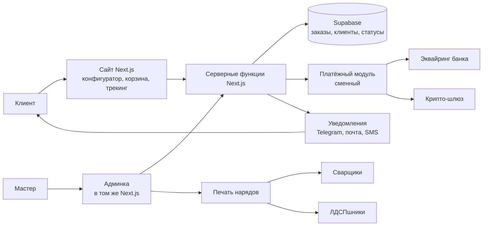

# RAKURS: описание проекта

Обновлено: 06.09.2026. Решения по стеку, этапам и админке приняты владельцем 06.09.2026.

Это главный документ проекта. Новый человек (или новая сессия Claude) начинает с него,
потом читает [process.md](process.md) про бизнес-процесс и [vision.md](vision.md),
где владелец описывает проект своими словами.

## Что это

Сайт мастерской стальной мебели RAKURS (Тбилиси): клиент собирает изделие в 3D-конфигураторе,
видит цену, оплачивает; заказ попадает в админку, откуда печатаются наряды сварщикам и ЛДСПшникам.
Решения делаются так, чтобы повторить их в других мастерских и странах.

## Кто пользуется

| Роль | Что делает в системе |
|---|---|
| Клиент | Собирает изделие, видит цену, оформляет и оплачивает заказ, следит за статусом, задаёт вопрос по заказу |
| Мастер (владелец) | В админке видит заказы, меняет статусы, печатает наряды |
| Сварщики | Получают распечатанный наряд на металлокаркас. В систему не заходят |
| ЛДСПшники | Получают распечатанный наряд на корпус. В систему не заходят |

## Что уже есть (на 06.09.2026)

- **Репозиторий** на GitHub, приватный, ветка `main`: https://github.com/Redeace/Rakurs_furniture
- **Бизнес-процесс** описан в `docs/process.md`.
- **Дизайн**: прототип «STAL Prototype» из Claude Design в `design/` (конфигуратор и печатная форма наряда)
  и дизайн-система «Каркас» в `design/_ds/` (шрифты Manrope и JetBrains Mono, тёплые серые нейтрали,
  один красный акцент, иконки Lucide).
- **3D**: прототип каркаса на Three.js (`design/Frame3D.js`), текстуры ЛДСП.
- **Приём заказов**: простая форма в `app/index.html` и функция Vercel `app/api/order.js`,
  которая кладёт заказ задачей в Todoist. Временное решение до этапа 2.

## Стек

| Слой | Выбор | Зачем | Чем платим |
|---|---|---|---|
| Сайт и админка | Next.js (React, TypeScript) | Одно приложение и один язык на сайт, админку и сервер. Vercel сделан под него | Нужна сборка, простым HTML уже не обойтись |
| Стили и компоненты | Tailwind CSS + shadcn/ui | Компоненты подгоняются под дизайн-систему «Каркас», а не наоборот | БЭМ, Material Design и Ant Design не используем: смешивать подходы нельзя |
| 3D | Three.js через react-three-fiber | Прототип уже на Three.js | 3D тяжёлое для слабых телефонов, нужна упрощённая модель |
| База, авторизация, файлы | Supabase (PostgreSQL) | Официальный SDK, пароли и сессии не пишем сами | Ещё один сервис. Бесплатный план засыпает после недели без обращений; перед продажами нужен платный (около 25 $/мес) |
| Сервер | Серверные функции Next.js на Vercel | Без отдельного сервера и его обслуживания | Ограничение по времени выполнения; тяжёлые задачи выносим отдельно |
| Хостинг | Vercel | Уже подключён, автосборка из GitHub | Бесплатный план Hobby только для некоммерческого использования. Перед запуском продаж переход на Pro (около 20 $/мес) |
| Оплата | Сменный модуль. Эквайринг банка Грузии + крипто-шлюз | Stripe в Грузии и Армении недоступен | Провайдеров выбираем на этапе 3. Карточные данные наш сервер не касаются |
| Уведомления | Telegram Bot API, почта, SMS | Клиент сам выбирает канал | Этап 4. Почта и SMS через внешних провайдеров |
| Печать нарядов | Страница печати в браузере | Уже есть в прототипе (`STAL Prototype-print`) | PDF только если печать из браузера не устроит |
| Языки | next-intl | Русский, грузинский, армянский | Этап 4. Все тексты сайта живут в файлах переводов, не в коде |
| Тесты | Vitest (модули) + Playwright (сценарии в браузере) | Тест пишется до кода | Время на тесты закладывается в каждую задачу |

## Как устроено

До этапа 2 вместо базы и админки работает Todoist: заказ с сайта падает туда задачей.

## Как идёт работа

1. Задача начинается с ветки от `main`: `feature/...`, `fix/...` или `docs/...`.
2. Сначала тест, потом код. Новая библиотека только после проверки `dependency-safety`.
3. Коммит с понятным описанием по-русски.
4. PR на GitHub. Vercel сам собирает превью-ссылку, владелец смотрит результат в браузере.
5. Слияние в `main`. Vercel выкатывает на прод.

Дизайн идёт параллельно: новая выгрузка из Claude Design кладётся zip-файлом в `_inbox/`,
распаковывается в `design/` и коммитится. Прошлые версии живут в истории git, не папками.

Секреты: локально в `.env`, на проде в настройках Vercel (Environment Variables).
В git и в переписку не попадают никогда.

## Этапы

Каждый этап заканчивается рабочей версией на сайте. Сроки ориентировочные, при работе по вечерам.

| Этап | Что получаем | Ориентир |
|---|---|---|
| 1. Конфигуратор + заказ | Клиент собирает изделие в 3D, видит цену, отправляет заказ. Оплаты нет, заказ падает в Todoist | 2–3 недели |
| 2. Админка | Заказы в базе. Мастер видит список, меняет статусы, печатает наряды раздельно для сварщиков и ЛДСПшников | 2 недели |
| 3. Онлайн-оплата | Оплата картой через банк Грузии и криптой. Модуль сменный | 2–4 недели, зависит от банка |
| 4. Языки и оповещения | Русский, грузинский, армянский. Клиент получает статус в Telegram, на почту или по SMS | 1–2 недели |

Админка своя, внутри того же приложения. Готовую CRM не подключаем: наряды и статусы
должны печататься как нужно мастерской, и решение должно копироваться в другие мастерские
без отдельной подписки на каждую.

## Правила проекта

1. Секреты только в `.env` и в настройках Vercel.
2. Оплата, авторизация и хранение карт только через официальные SDK провайдеров.
3. Любая новая библиотека проходит проверку `dependency-safety` до установки.
4. Тест до кода. «Готово» говорим только после проверки.
5. Одна задача = одна ветка и один PR. Документация в `docs/` обновляется вместе с кодом.

## Открытые вопросы

- Первый язык сайта: русский. Грузинский и армянский на этапе 4.
- Контакты мастерской (адрес, телефон, почта): в двух версиях дизайна разные, нужны точные.
- Способ покраски: в дизайн-системе «порошковая», на сайте «нитрокраска краскопультом».
- Провайдеры оплаты: какой банк и какой крипто-шлюз. Решаем на этапе 3.
- Переход Vercel и Supabase на платные планы перед запуском продаж.
- Проект `rakurs-furniture` на Vercel привязан к репозиторию `Redeace/Claude_test`,
  а не к `Redeace/Rakurs_furniture`. Автодеплой из настоящего репозитория пока не работает.
  Перепривязать при настройке инфраструктуры. Два лишних проекта `stal-prototype-3d-*` и `3d-*`
  на Vercel не привязаны к git: это разовые выгрузки прототипа, можно удалить.

## Ссылки

- GitHub: https://github.com/Redeace/Rakurs_furniture
- Vercel: команда «redeace's projects», проект `rakurs-furniture` (план Hobby)
- Бизнес-процесс: [process.md](process.md)
- Дизайн-система: `design/_ds/karkas-steel-design-system-*/readme.md`
